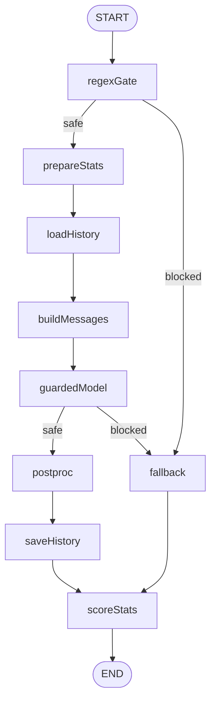
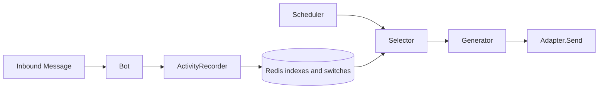

# llm-bot

`llm-bot` 是一个用 Go 编写的 LLM IM 机器人骨架：通过 OneBot v11 接入 QQ，把被动回复、防提示词注入、人设状态和可控主动消息拆成清晰的模块。

## 功能亮点

- **OneBot v11 反向 WebSocket 接入**：面向 NapCatQQ 等 OneBot v11 实现，当前 Adapter 提供反向 WS 服务端、触发过滤、私聊 / 群聊消息归一化和发送封装。
- **OpenAI 兼容 LLM**：主回复、裁判、stats 打分和主动消息生成都基于 OpenAI 兼容接口，编排层使用 CloudWeGo eino 的 `compose.Graph`。
- **并行防提示词注入**：先走正则黑名单 `regexGate`，放行后在 `guardedModel` 内并行运行主模型和 LLM 裁判；裁判判定攻击时取消主链并进入 fallback 降级回复。
- **Redis 状态存储**：Redis 不只保存对话历史，也保存 stats 人设参数、主动消息运行期开关、白名单、候选索引、冷却和短期上下文。
- **stats 人设参数**：好感度使用全局 ZSET，心情使用全局 Hash；`prepareStats` 在组装 prompt 前读取快照，`scoreStats` 在回复生成后异步调用打分模型并写回 Redis。
- **主动发消息侧路**：`ActivityRecorder` 记录入站活跃，`Selector` 从好感度排行和白名单群近期活动中挑候选，`Generator` 生成短开场白，`Scheduler` 做时间窗、日限额、冷却和 dry-run 控制，最终通过 `Adapter.Send` 发送 `ReplyTo == nil` 的纯文本消息。
- **YAML 人设与护栏配置**：`configs/config.yaml` 管连接、模型、触发、guard、stats 和 proactive 策略；`configs/prompts/default.yaml` 管人设文本。API key、Redis 密码和服务端 token 支持环境变量覆盖。

## 当前状态

这是一个个人项目性质的机器人骨架，目标是把关键边界拆清楚，方便继续演进到不同平台、不同模型和更多 Graph 节点。默认配置比较保守：主动消息 `proactive.enabled` 默认关闭，即使开启也建议先保持 `dry_run: true` 观察候选和生成质量。

主动消息调度器当前按单进程设计，没有内置分布式锁、主从选举或管理后台。多实例部署时应只让一个实例启动 scheduler，或在外部补齐调度互斥。

## 快速开始

### 环境要求

- Go 1.25+
- Redis
- OpenAI 兼容的对话模型服务，例如 OpenAI、DeepSeek、Qwen 兼容模式、OneAPI 等
- NapCatQQ 或其他 OneBot v11 实现

### 配置

编辑 `configs/config.yaml`，至少确认以下几组配置：

```yaml
server:
  addr: ":8080"
  ws_path: "/onebot/v11"

redis:
  addr: "127.0.0.1:6379"

llm:
  base_url: "https://dashscope.aliyuncs.com/compatible-mode/v1"
  api_key: ""
  model: "qwen3.6-plus"

judge:
  base_url: "https://dashscope.aliyuncs.com/compatible-mode/v1"
  api_key: ""
  model: "qwen-turbo"
```

敏感配置推荐通过环境变量注入，非空时会覆盖 YAML：

```bash
export LLMBOT_LLM_API_KEY="sk-..."
export LLMBOT_JUDGE_API_KEY="sk-..."
export LLMBOT_REDIS_PASSWORD="..."
export LLMBOT_SERVER_ACCESS_TOKEN="..."
```

人设和部分护栏文本在 `configs/prompts/default.yaml` 中调整，修改后需要重启进程。`<user_input>` 包裹、judge 判定契约和 stats 打分 JSON 契约属于代码侧安全 / 解析约定，不作为普通 YAML 文案开放。

### 运行

仓库提供了 Makefile：

```bash
make build
make run
```

其中 `make run` 会先编译，再后台启动 `bin/bot`，日志写入 `output.log`。开发时也可以直接运行：

```bash
go run ./cmd/bot -config configs/config.yaml
```

默认监听 `:8080`，反向 WS 路径是 `/onebot/v11`。

### NapCat 反向 WS 示例

在 NapCat 的 OneBot v11 配置中开启反向 WebSocket，并让它连接本服务：

```json
{
  "enable": true,
  "host": "127.0.0.1",
  "port": 3001,
  "reverseWs": {
    "enable": true,
    "urls": ["ws://127.0.0.1:8080/onebot/v11"]
  },
  "token": ""
}
```

如果 `server.access_token` 或 `LLMBOT_SERVER_ACCESS_TOKEN` 非空，NapCat 侧也需要配置对应 token。当前 Adapter 对 NapCat 常见的数组消息段支持最好；旧 CQ 码字符串会被当作纯文本处理，群聊 `@bot` 触发能力会退化。

## 配置说明

- `server`：HTTP / WebSocket 服务端配置。`addr` 是监听地址，`ws_path` 需要和 NapCat 反向 WS URL 一致，`access_token` 非空时校验握手 token。
- `redis`：Redis 连接配置。Redis 同时承载历史、stats、主动消息运行期状态和索引；当前不包含集群 / 哨兵配置封装。
- `llm`：主回复模型配置，要求兼容 OpenAI Chat Completions 协议。
- `judge`：裁判模型配置。当前同时被提示词注入裁判和 stats 异步打分复用，通常可以选择更便宜、响应更快的模型。
- `agent`：Agent 层参数，包括每个 session 的历史条数和人设 YAML 路径。
- `guard`：防提示词注入相关配置，包括正则黑名单、是否启用 LLM 裁判、fallback 回复池。
- `trigger`：Adapter 层源头触发规则。私聊可直接触发，群聊可配置为只在 `@bot` 或显式前缀命中时触发。
- `blacklist`：用户黑名单。`user_ids` 中的用户会在 Adapter 源头被忽略，不进入历史、stats 或 LLM 调用。
- `stats`：人设参数开关。启用后，回复前读取好感度 / 心情快照，回复生成后异步打分；失败只记录日志，不阻断主回复。
- `proactive`：主动消息静态策略。`enabled` 是部署期总开关，关闭时不会装配主动消息 recorder / scheduler；`dry_run` 默认为 true，用于只记录“本来会发什么”而不真正发送。

主动消息还有两类运行期开关保存在 Redis：全局 runtime switch 和群白名单。只有 `proactive.enabled: true`、Redis runtime switch 为真、目标群在白名单内，并且时间窗 / 冷却 / 日限额都满足时，scheduler 才会真实发送。目前仓库没有内置管理命令或后台页面，相关 Redis key 由运维脚本直接维护，或留给后续管理入口接管。

## 架构

### 被动回复 Graph



- `regexGate`：同步正则黑名单检测，命中后直接进入 fallback。
- `prepareStats`：在 prompt 组装前结算 mood 自然回归并读取 stats 快照。
- `loadHistory`：从 Redis 读取最近 N 条历史。
- `buildMessages`：组装 system、人设参数、历史和当前用户输入。
- `guardedModel`：主模型和 LLM 裁判并行运行，裁判判攻击时取消主链。
- `postproc`：清洗模型回复，保证内容可发送。
- `saveHistory`：只在安全主链保存 user + assistant 历史，降级路径不写历史。
- `fallback`：从配置池随机选择降级回复。
- `scoreStats`：对正常和降级回复都异步触发 stats 打分。

### 主动消息侧路



主动消息不进入 Agent Graph。`Bot` 只依赖 `ActivityRecorder` 的窄接口，把真实入站活跃旁路记录到 Redis；`Scheduler` 在后台按间隔扫描，经过运行期开关、时间窗、日限额、候选选择、生成和 dry-run 判断后，才调用同一个 Adapter 发送纯文本消息。

## 目录结构

```text
llm-bot/
├── cmd/bot/main.go                 进程入口：加载配置、装配 Redis / Agent / Adapter / proactive
├── configs/
│   ├── config.yaml                 主配置：server / redis / llm / judge / agent / guard / trigger / stats / proactive
│   └── prompts/default.yaml        人设与可调 prompt 文案
├── internal/
│   ├── adapter/
│   │   ├── adapter.go              IM 平台统一接口
│   │   └── onebot/                 OneBot v11 反向 WS 实现
│   ├── agent/
│   │   ├── agent.go                eino Graph 装配
│   │   ├── model.go                OpenAI 兼容 ChatModel 构造
│   │   ├── prompt.go               YAML Persona 加载与消息构造
│   │   ├── flow/                   Input / State / Verdict 等 Graph 流转类型
│   │   ├── guard/                  regexGate、LLM judge、guardedModel
│   │   └── nodes/                  prepareStats、loadHistory、buildMessages、postproc、saveHistory、fallback、scoreStats
│   ├── bot/                        Adapter 到 Agent 的主循环，以及 ActivityRecorder 窄接口
│   ├── config/                     YAML 加载、校验、敏感配置环境变量覆盖
│   ├── domain/                     平台无关消息模型
│   ├── proactive/                  主动消息状态、记录器、候选选择、生成器、调度器
│   ├── stats/                      好感度、心情、异步打分与 Redis 写入
│   └── store/                      Redis 客户端与对话历史仓库
├── Makefile
├── LICENSE
└── README.md
```

## 设计原则

1. **Graph 是被动回复编排的事实来源**：节点和边表达控制流，业务分支不散落在 Bot 主循环里。
2. **Bot 保持薄**：Bot 只负责 Adapter 到 Agent 的搬运、并发控制、发送回复，以及调用 `ActivityRecorder` 这个窄接口。
3. **装饰性状态 fail-soft**：stats 和 proactive 的旁路记录失败只打日志，不阻断主回复；stats 打分异步执行，不把额外延迟压到用户请求上。
4. **主动消息默认安全关闭**：静态总开关默认关闭，运行期还需要 Redis 开关；群聊必须走白名单，真实发送前优先使用 dry-run 观察。
5. **防御契约收敛在代码里**：正则列表和 fallback 文案可配置，但 `<user_input>` 包裹、judge 输出契约和 stats JSON schema 不随普通人设文案漂移。
6. **Adapter 可替换**：Agent 和 Bot 只依赖平台无关消息模型与 `adapter.Adapter`，接入其他 IM 平台时优先新增 Adapter 子包，而不是改 Agent Graph。

## 扩展指南

- 接入微信、Telegram 或其他 IM：在 `internal/adapter/` 下新增实现，转换成 `domain.InboundMessage` / `domain.OutboundMessage`。
- 增加 Agent 节点：在 `internal/agent/nodes/` 或 `internal/agent/guard/` 增加节点，并在 `agent.Build` 中显式接入 Graph。
- 替换或增加模型供应商：优先在 `internal/agent/model.go` 收敛模型构造逻辑，保持上层继续使用 eino `BaseChatModel`。
- 增加 RAG：可在 `loadHistory` 和 `buildMessages` 之间插入 retriever 节点，把召回内容注入 State 后再组装 prompt。
- 扩展 stats：在 `internal/stats/` 增加 Snapshot / Delta 字段、Redis 读写和打分 JSON 字段，再由 `PromptLine` 注入系统提示词。
- 完善主动消息管理：当前运行期开关和群白名单已有 Redis 状态层，后续可以补管理入口；当前仓库尚未提供内置管理命令或后台页面。

## License

MIT，见 [LICENSE](./LICENSE)。
