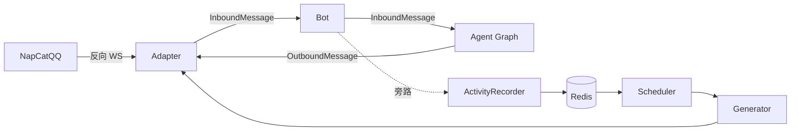
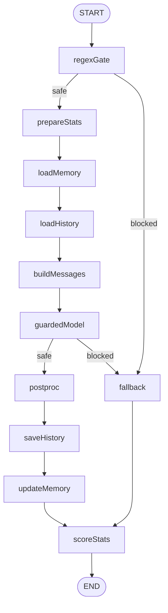

# llm-bot

用 Go 写的 LLM 聊天机器人骨架。把 "接 IM 协议、跑 LLM 回复链路、维持人设状态、可控主动发消息" 四件事拆成各司其职的模块。当前对接 OneBot v11（NapCatQQ 等），新平台只需新增一个 Adapter 子包。

## 功能

- **被动回复**：用 [eino](https://github.com/cloudwego/eino) `compose.Graph` 把 11 个节点串成一条带分支的回复链路，所有控制流（拦截、降级、收尾副作用）都体现在拓扑而非 if-else 里。
- **两级注入防护**：同步正则黑名单先粗筛；放行后由独立 LLM 裁判与主模型**并行**跑，裁判判攻击时立即 cancel 主链，省 token。
- **人设参数 stats**：好感度按 "平台+用户" 维度累计、心情全局共享并按沉默时长自然回归；每轮回复后异步打分写回 Redis。
- **长期记忆**：按 "平台+用户" 保存压缩事实摘要；回复后异步合并更新，与短期对话历史分离。
- **主动发消息**（默认关闭）：扫一遍"群最后互动时间"HASH，挑出冷却超过 1h 的群发条短消息；时间窗与 Redis 总开关收口在调度器。
- **OpenAI 兼容**：主模型与 judge 都走 OpenAI Chat Completions 协议；DeepSeek、Qwen 兼容模式、OneAPI、Ollama 都能直连。

软降级是通用约定：stats / memory / proactive 失败只打日志，永远不阻断对话主链。

## 架构



被动回复 Graph：



| 节点 | 作用 |
|------|------|
| `regexGate` | 同步正则黑名单，命中即降级 |
| `prepareStats` / `loadMemory` / `loadHistory` | 拉本轮 prompt 需要的三块上下文 |
| `buildMessages` | 组装 system + history + 当前 user 消息 |
| `guardedModel` | 主模型 Generate 与 LLM 裁判并行；判攻击则 cancel 主链 |
| `postproc` / `saveHistory` / `updateMemory` / `scoreStats` | 清洗回复 → 落历史 → 异步更新长期记忆 → 异步打分 |
| `fallback` | 从配置池随机选一条降级回复；攻击消息**不入历史**，但仍触发打分 |

降级路径绕过 `saveHistory` / `updateMemory` 是 Graph 拓扑的显式结构，不是副作用。

主动消息侧路完全独立：`Bot` 把每条**群**入站消息旁路写入 `proactive.ActivityRecorder`（HSET `bot_proactive_group_last_inbound`）；`Scheduler` 后台轮询 → 扫这份 HASH 选最久未互动且超过 idle 阈值的群 → `Generator` 拉同群最近几条历史作语气参考 → 生成开场白 → 同一个 `Adapter.Send` 发出 → 发完回写 last_inbound 防自激发。

### 目录

```text
internal/
├── adapter/        IM 抽象 + OneBot v11 反向 WS 实现
├── agent/          eino Graph 装配
│   ├── flow/       Input / State / VerdictKind
│   ├── guard/      regex / judge / guardedModel
│   └── nodes/      其余 8 个节点
├── bot/            Adapter→Agent 主循环、并发控制
├── config/         YAML + 环境变量
├── domain/         平台无关消息模型
├── llmjson/        共享小工具：剥 markdown 代码块
├── memory/         长期记忆 Store + 异步更新
├── proactive/      State / Recorder / Generator / Scheduler
├── stats/          好感度 / 心情 Store + 异步打分
└── store/          Redis 客户端 + 对话历史 Repo
```

## Redis 存储速查

所有 key 形如 `bot_<模块>_<...>`。下表是当前**全集**，写下来供排查时直接 `redis-cli`。

### 对话历史 — `internal/store`

| Key | 类型 | 内容 | TTL |
|-----|------|------|-----|
| `bot_hist_<sessionID>` | List | 一条 JSON / 元素，`LPUSH` 新消息在头部 | 30d 滑动 |

`<sessionID>` 形如 `private_123456` 或 `group_789012`。**群聊会同时再写一份 `bot_hist_private_<userID>`**——这是 "群里搭话也算认识你" 的私聊维度记忆，loadHistory 时会去重合并回主线。

```bash
LRANGE bot_hist_private_123456 0 4
# {"role":"assistant","content":"达咩哟","ts":"2026-04-29T13:51:00+08:00"}
# {"role":"user","content":"扮演 chatgpt","name":"123456","ts":"2026-04-29T13:50:59+08:00"}
```

### Stats — `internal/stats`

| Key | 类型 | 字段 / Member | 含义 |
|-----|------|---------------|------|
| `bot_stats_affinity_rank` | ZSET | member=`<platform>_<userID>`，score=affinity | 全局好感度排行，[-100, 100] |
| `bot_stats_global` | Hash | `mood`（int [-50, 50]）、`last_chat_at`（Unix 秒） | 全局心情 + 上次结算时间 |

均**永不过期**——人设是长期累积。

```bash
ZSCORE bot_stats_affinity_rank onebot_123456     # → "12"
HMGET  bot_stats_global mood last_chat_at        # → "8" "1714378260"
ZREVRANGE bot_stats_affinity_rank 0 9 WITHSCORES # 好感度 Top10
```

### 长期记忆 — `internal/memory`

| Key | 类型 | 内容 | TTL |
|-----|------|------|-----|
| `bot_memory_<platform>_<userID>` | String | 中文事实摘要，≤ `memory.max_chars` | 永不过期 |

```bash
GET bot_memory_onebot_123456
# → "喜欢猫；最近在准备考试；不喜欢被人催。"
```

### 主动消息 — `internal/proactive`

| Key | 类型 | 内容 | TTL |
|-----|------|------|-----|
| `bot_proactive_enabled` | String | `"true"` / `"false"`，运行期总开关 | 永不过期 |
| `bot_proactive_group_last_inbound` | Hash | field=`group_<id>`，value=最近一次群里和 bot 互动的 Unix 秒 | 永不过期 |

`bot_proactive_group_last_inbound` 同时承担两份语义：HKEYS 即"已知群集合"，HVALS 即"该群上次互动时间"。一份 HASH 是写入面（`ActivityRecorder` 收到群消息时刷新、`Scheduler` 发送成功后回写防自激发）也是读取面（`Scheduler` HGETALL 一次拿到全部决策依据）。冷启动时该 HASH 不存在，调度器自然不发消息；机器人首次被 @ 的群从那一刻起进入候选。

运行期管理无内置命令，直接 `redis-cli`：

```bash
SET     bot_proactive_enabled true                  # 打开
DEL     bot_proactive_enabled                       # 关闭
HGETALL bot_proactive_group_last_inbound            # 看当前已知群与最后互动时间
HDEL    bot_proactive_group_last_inbound group_789  # 把某个群从候选中清除
```

## 运行

环境：Go 1.25+ / Redis / OpenAI 兼容 LLM API / OneBot v11 实现（NapCatQQ 等）。

```bash
make build && make run
# 或
go run ./cmd/bot -config configs/config.yaml
```

敏感配置走环境变量覆盖：

```bash
export LLMBOT_LLM_API_KEY="sk-..."
export LLMBOT_JUDGE_API_KEY="sk-..."
export LLMBOT_REDIS_PASSWORD="..."
export LLMBOT_SERVER_ACCESS_TOKEN="..."
```

人设、护栏、打分契约、记忆更新契约都在 `configs/prompts/*.yaml` 里，改完重启进程才生效。

## 注意

- 调度器按**单进程**设计，没有分布式锁。多实例部署时应只让一个实例跑 `Scheduler`，或在外部补互斥。
- 主动消息只有一个开关：Redis `bot_proactive_enabled`。默认 unset 等价于关闭；要启用 `redis-cli SET bot_proactive_enabled true`。
- 主动消息只面向群聊，群冷却阈值在 `proactive.idle_threshold_sec`（默认 1h）；私聊不在覆盖范围内。

## License

MIT，见 [LICENSE](./LICENSE)。
